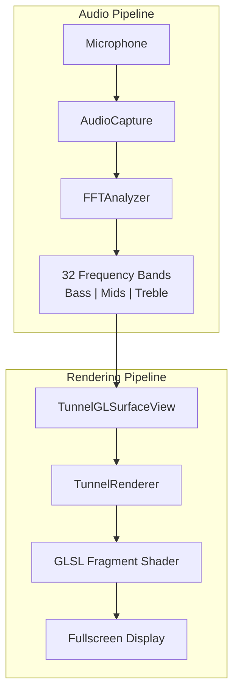

# CoasterTunnel

An immersive Android application that creates a real-time audio-reactive tunnel visualization. The app captures microphone audio, performs FFT analysis to extract frequency bands, and renders a dynamic tunnel effect using OpenGL ES 3.0 shaders.

**Try it in your browser:** [micronant.com/coastertunnel](https://micronant.com/coastertunnel/) runs these same shaders in WebGL2, with the analyser ported to JavaScript, a synthesized demo beat and an optional microphone mode.

## Overview

CoasterTunnel transforms audio input into a mesmerizing visual experience. As you play music or make sounds, the app analyzes the audio spectrum in real-time and renders colorful frequency lines that spiral through a tunnel-like space, creating a "warp speed" effect synchronized with the audio.

## Features

- **Real-time Audio Analysis**: Captures audio at 44.1kHz and performs FFT analysis to extract 32 frequency bands
- **Dynamic Visualization**: 
  - Anti-aliased, glowing radial frequency lines that ripple with audio history
  - Tunnel rings and a radially streaking starfield that rush past at the tempo
  - Pulsing center core that reacts to bass, with a shockwave on every beat
  - Smooth attack/decay envelope for fluid visual transitions
- **Fullscreen Immersive Experience**: Landscape orientation with hidden system UI
- **Audio History Tracking**: Maintains a rolling history texture for temporal effects
- **Beat and Tempo Detection**: Bass energy against a threshold that adapts to recent variance gives a beat flag and a smoothed BPM. Starfield speed, tunnel rings and rotation follow the tempo. The spin swings round to reverse when a beat shows the tempo has moved by more than 5 BPM (at most once every 2 seconds), and a tap brakes it back to its starting angle
- **High Performance**: Optimized OpenGL ES 3.0 rendering with efficient shader code

## Requirements

- **Android**: Minimum SDK 26 (Android 8.0), Target SDK 34
- **Permissions**: `RECORD_AUDIO` (requested at runtime)
- **Hardware**: OpenGL ES 3.0 capable device

## Building and Running

### Prerequisites

- Android Studio or command-line Android SDK tools
- Gradle (included via wrapper)
- Android device with USB debugging enabled, or emulator

### Build Steps

1. Navigate to the Android project directory:
   ```bash
   cd android
   ```

2. Build and install the debug APK:
   ```bash
   ./gradlew installDebug
   ```

3. Or use the provided build script:
   ```bash
   ./build_android.sh
   ```
   With more than one device attached, set `ANDROID_SERIAL` to choose which one the script launches on.

4. Grant microphone permission when prompted on first launch.

### Project Structure

```
CoasterTunnel/
├── android/
│   ├── app/
│   │   ├── src/main/
│   │   │   ├── java/com/coaster/tunnel/
│   │   │   │   ├── MainActivity.kt              # Entry point, permissions
│   │   │   │   ├── audio/
│   │   │   │   │   ├── AudioCapture.kt         # PCM audio capture
│   │   │   │   │   └── FFTAnalyzer.kt          # FFT analysis, 32-band extraction
│   │   │   │   └── gl/
│   │   │   │       ├── TunnelGLSurfaceView.kt  # OpenGL ES 3.0 surface
│   │   │   │       └── TunnelRenderer.kt       # Renderer, shader uniforms
│   │   │   └── res/raw/
│   │   │       ├── tunnel_vert.glsl            # Vertex shader
│   │   │       └── tunnel_frag.glsl            # Fragment shader (main effect)
│   │   └── build.gradle
│   └── build.gradle
└── assets/shaders/                              # Additional shader files (WGSL)
    ├── tunnel_warp.wgsl
    └── graph.wgsl
```

## Architecture

The application follows a pipeline architecture from audio capture to visual rendering:



### Data Flow

1. **Audio Capture** (`AudioCapture.kt`): 
   - Uses Android's `AudioRecord` API to capture PCM float samples at 44.1kHz
   - Reads 2048-sample buffers (FFT size) in a background thread
   - Passes samples to the analyzer via callback

2. **FFT Analysis** (`FFTAnalyzer.kt`):
   - Applies Hann window function to reduce spectral leakage
   - Performs Radix-2 FFT on 2048 samples
   - Groups frequency bins into 32 logarithmic bands (60Hz - 22kHz)
   - Applies smoothing with attack/decay envelope (attack: 25.0, decay: 8.0)
   - Extracts summary bands: Bass (0-3), Mids (4-19), Treble (20-31)

3. **Rendering** (`TunnelRenderer.kt`):
   - Updates a 512x8 RGBA history texture (32 bands packed into 8 rows)
   - Eases bands toward each new analysis every frame, since audio arrives at about 21 Hz but frames at 60 Hz
   - Passes audio data to shader via uniforms:
     - `uTime`: Elapsed time, wrapped to one turn (2π) so it never loses float precision
     - `uAudio`: Bass, mids, treble summary
     - `uBands`: 32-band array
     - `uAudioHistory`: History texture for temporal effects
     - `uOffset`: Ring buffer read head, sliding between audio frames
     - `uRotation`, `uSpinVel`: Wrapped spin angle and its smoothed velocity
     - `uStarTime`, `uSpeed`: Tempo-driven travel for the stars and rings
     - `uBeatAge`: Seconds since the last beat, for the beat pulse and shockwave

4. **Visual Effects** (`tunnel_frag.glsl`):
   - **Frequency Lines**: Each of 32 bands maps to a radial sector. Lines oscillate based on audio history, creating a wave that travels outward
   - **Tunnel Rings**: Perspective rings rushing past at the tempo, flaring on each beat
   - **Warp Stars**: Grid-based procedural starfield streaking radially with tempo
   - **Center Core**: Pulsing white core that expands with bass and fires a shockwave on each beat
   - **Vignette and Dither**: Darkened edges for tunnel effect, dithered to hide 8-bit banding

## Key Components

| Component | File | Purpose |
|-----------|------|---------|
| Entry Point | [`MainActivity.kt`](android/app/src/main/java/com/coaster/tunnel/MainActivity.kt) | Handles permissions, fullscreen setup, lifecycle |
| Audio Capture | [`AudioCapture.kt`](android/app/src/main/java/com/coaster/tunnel/audio/AudioCapture.kt) | PCM audio capture at 44.1kHz, 2048-sample buffers |
| FFT Analysis | [`FFTAnalyzer.kt`](android/app/src/main/java/com/coaster/tunnel/audio/FFTAnalyzer.kt) | Radix-2 FFT, 32-band logarithmic grouping, smoothing |
| GL Surface | [`TunnelGLSurfaceView.kt`](android/app/src/main/java/com/coaster/tunnel/gl/TunnelGLSurfaceView.kt) | OpenGL ES 3.0 context management, audio integration |
| Renderer | [`TunnelRenderer.kt`](android/app/src/main/java/com/coaster/tunnel/gl/TunnelRenderer.kt) | Shader compilation, uniform updates, history texture |
| Fragment Shader | [`tunnel_frag.glsl`](android/app/src/main/res/raw/tunnel_frag.glsl) | Visual effect computation (frequency lines, stars, core) |

## Technical Details

### Audio Processing

- **Sample Rate**: 44.1kHz
- **Format**: PCM Float, Mono
- **Buffer Size**: 2048 samples (matches FFT size)
- **FFT**: Radix-2 iterative implementation
- **Window Function**: Hann window
- **Frequency Bands**: 32 logarithmic bands from 60Hz to 22kHz
- **Smoothing**: Exponential attack/decay with configurable rates

### Rendering

- **API**: OpenGL ES 3.0
- **Resolution**: Adaptive to screen size
- **Frame Rate**: Continuous rendering (60 FPS target)
- **History Texture**: 512x8 RGBA8 texture (512 frames of 32-band history)
- **Shader Language**: GLSL ES 3.00

### Visual Effects Breakdown

1. **Radial Frequency Lines**: 
   - Each frequency band occupies a radial sector
   - Lines oscillate using a carrier wave modulated by audio history
   - Thickness follows loudness and perspective; widths are measured across the ripple, so steep sections don't thin out
   - Anti-aliased: lines thinner than a pixel dim rather than breaking up into dots
   - Neighbouring sectors are evaluated too, so wide lines and their glow are never clipped at sector borders
   - Smooth spectral color (hue based on band index), with white-hot cores where the band is busy
   - Fogged toward the vanishing point
   - The spin is rigid, plus a lean in the direction of travel that follows the spin velocity, so it never winds up into a moiré

2. **Tunnel Rings**:
   - Rings spaced evenly in depth, moving with the tempo
   - Fade out where they bunch up closer than a few pixels near the center

3. **Warp Starfield**:
   - Procedural grid-based stars using hash functions, aspect-correct and spinning with the tunnel
   - Stars grow as they approach and streak radially with tempo
   - Kept inside their grid cells, so none are cut off at cell edges
   - Brighter and larger with treble, with a gentle twinkle

4. **Center Singularity**:
   - White core with bass-reactive radius that also pulses on the beat
   - Warm halo and bounded rim glow
   - Shockwave ring expanding outward from each beat

## Development

### Dependencies

- `androidx.core:core-ktx:1.12.0`
- `androidx.appcompat:appcompat:1.6.1`
- `androidx.activity:activity-ktx:1.8.2`

### Build Configuration

- **Language**: Kotlin
- **Java Version**: 17
- **Compile SDK**: 34
- **Min SDK**: 26
- **Target SDK**: 34

## License

Licensed under either of [Apache License, Version 2.0](LICENSE-APACHE) or [MIT license](LICENSE-MIT) at your option.
